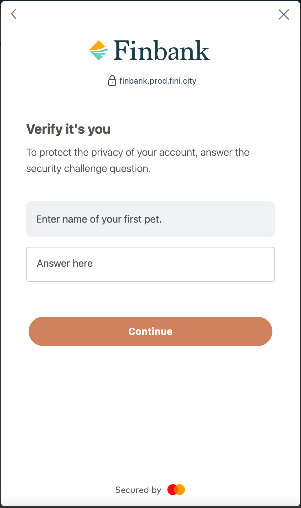
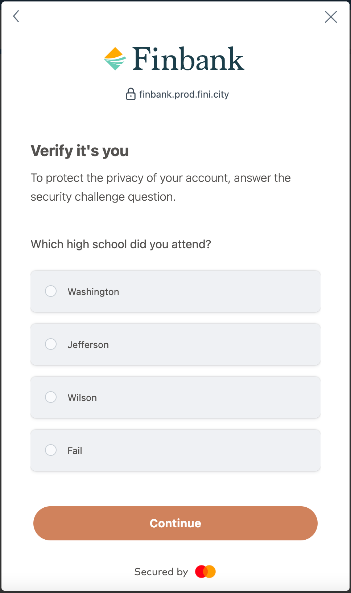
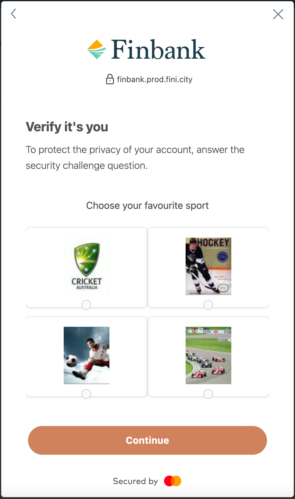
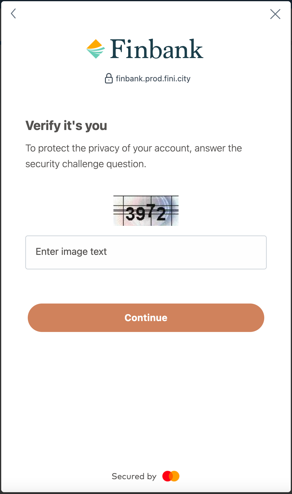

***OUTSTANDING DOCUMENTATION TASKS:***
- [ ] Add code example for the [login event](#login-oauth-only) payload
- [ ] Finalize payload for [error event](#error) payload
- [ ] Validate all links. Including:
  - [ ] CC API docs, when they have a public domain not just api curio
  - [ ] [Open Banking docs](https://api-reference.finicity.com)
  - [ ] MDN documentation
  - [ ] Add any additional documentation links as appropriate
- [ ] Clarify if event listeners are attached on the `events` or `eventSteam` property of the mastercard form element, particularly in the [usage section](#usage)
- [ ] Add code example for what the Oauth redirect page could look like

# Connect Components SDK: Web  
## Table of Contents
- [Connect Components SDK: Web](#connect-components-sdk-web)
  - [Table of Contents](#table-of-contents)
  - [Overview](#overview)
    - [Elements](#elements)
      - [Mastercard Form](#mastercard-form)
      - [Mastercard Input](#mastercard-input)
      - [Mastercard MFA Input](#mastercard-mfa-input)
        - [Note: MFA Challenge](#note-mfa-challenge)
      - [Mastercard Event Stream](#mastercard-event-stream)
    - [Events](#events)
      - [`login` (Oauth only)](#login-oauth-only)
      - [`success`](#success)
      - [`error`](#error)
      - [`mfaChallenge` (*Legacy login only*)](#mfachallenge-legacy-login-only)
        - [MFA Challenges Types](#mfa-challenges-types)
          - [1. `TFA_TEXT`](#1-tfa_text)
          - [2. `TFA_CHOICE`](#2-tfa_choice)
          - [3. `TFA_MULTI`](#3-tfa_multi)
          - [4. `TFA_IMAGE`](#4-tfa_image)
  - [Installation](#installation)
  - [Usage](#usage)
    - [Login Form Usage](#login-form-usage)
      - [Render Login Form](#render-login-form)
      - [Submit Login Form](#submit-login-form)
      - [Successful Financial Institution Connection](#successful-financial-institution-connection)
      - [MFA Required for Connection](#mfa-required-for-connection)
        - [TFA\_TEXT](#tfa_text)
        - [TFA\_CHOICE](#tfa_choice)
        - [TFA\_MULTI](#tfa_multi)
        - [TFA\_IMAGE](#tfa_image)
        - [Submit MFA challenge](#submit-mfa-challenge)
      - [Error Occurred During Connection Attempt](#error-occurred-during-connection-attempt)
    - [Oauth Usage](#oauth-usage)
      - [Determining How To Navigate To the Oauth Url](#determining-how-to-navigate-to-the-oauth-url)
      - [Popup](#popup)
      - [Redirection](#redirection)
## Overview
This project provides a means for partners to integrate with Connect Components API via a web browser. The SDK provides a collection of custom Web Components that can be used to build login forms for legacy institutions, initiate Oauth authentication flow for institutions, and render Multi-Factor Authorization challenges encountered during legacy institution login.
### Elements
All elements are custom [Web Components](https://developer.mozilla.org/en-US/docs/Web/API/Web_components) and provide a framework-agnostic way to encapsulate logic needed for each element. These elements enable developers to have complete control over the customer experience.
#### Mastercard Form
```html
<mastercard-form type='institution-login' id="" ></mastercard-form>
```
The custom form element is responsible for brokering `postMessage` connections to the `<mastercard-input>` and `<mastercard-mfa-input>` elements. For institution logins, both legacy and oauth, the attribute `type='institution-login'` will be set.
#### Mastercard Input
```html
<mastercard-input id=""></mastercard-input>
```
These elements provide the core functionality for ***legacy*** institution login forms. There will need to be one `<mastercard-input>` for each of the login form inputs that is returned by the [Connect Components API](https://apicurio-registry.dev.fini.city/ui/artifacts/open-banking-gold-standard/open-banking-gold-standard%2Fconnect-components-api%2Fconnect-components-api-us.yaml/versions/latest#operation/post-institutions-institutionId-login-forms). This is typically just `username` and `password`, but there are some login forms that have a third or even forth required input. Each `<mastercard-input>` element should have a single `id` attribute so the Connect Components SDK can render the correct login form data.
#### Mastercard MFA Input 
```html
<mastercard-mfa-input id=""></mastercard-mfa-input>
```
This is the element type that is used to capture a response from a customer. It can be an image or text box and depends on the MFA Challenge response. All that is needed from the calling application is an `id` attribute on the `mastercard-mfa-input` so the Connect Components SDK can render the correct MFA challenge data.
##### Note: MFA Challenge
The MFA challenge will use the same <mastercard-form> element as the login forms, but with the `type="mfaChallenge"` attribute.
```html
<mastercard-form type="mfaChallenge">
  <mastercard-mfa-input id=""></mastercard-mfa-input>
</mastercard-form>
```
#### Mastercard Event Stream
In a legacy login, this element is created automatically by the SDK when a [`<mastercard-form>`](###mastercard-form) element is added to the page. In some of the example below, you will notice the [`<mastercard-form>`](###mastercard-form) has the `event-stream-id`. This attribute allows the SDK to associate the correct events with the intended `<mastercard-form>`. 

During an Oauth login, this element will need to be added on the page the customers will be redirected to after the `login` event is emitted. This will allow the application to receive the `success` and `error` events emitted from the SDK. 
```html
<mastercard-event-stream></mastercard-event-stream>
```

### Events
#### `login` (Oauth only)
This event is triggered once the customer has completed the **Oauth** login flow with their financial institution. At this point, the calling application may close the **Oauth** popup window.
```json
INSERT LOGIN EVENT PAYLOAD HERE
```
#### `success` 
When the Mastercard Connect Components API has successfully connected to a customer's account(s), the `success` event will be emitted. The payload for this event is an array of objects. Each object represents a single successful account connection. 
```json
[
  {
  "customerId": "6021877507",
  "institutionId": "101732",
  "institutionLoginId": 6018508414,
  "accountId": "6038699817"
  }
]
```
#### `error` 
When an error is encountered during the login process, this error will be captured and returned in the `error` event. The event payload will contain the needed information to enable your application to guide the customer in resolving the error, if resolvable. The payload on the `error` event will typically contain at least `code` and  `message` properties:
```json
{
  //Determine if there are more properties that will be returned with this payload.
  //will it be a standard error object: https://api-reference.finicity.com/#/rest/models/exceptions/error-message-error?
  "code": 103,
  "message": "The login credentials you entered are not valid for this account. Please log into your bank’s site and make sure you have access and then try again. Error code 103",
}
```
All of the error codes are documented in the Mastercard Open Banking Api section for [api errors](https://docs.finicity.com/api-errors/).
#### `mfaChallenge` (*Legacy login only*) 
While attempting to connect to customer accounts, a financial institution may send back a multi-factor challenge that the customer must complete to continue the login process. When a MFA Challenge is raised by an institution, a [`mfaChallenge`](##mfa-challenges) event will be emitted. The `mfaChallenge` payload is an array of objects. Each object represents a single MFA challenge that needs to be resolved by the customer.
```json
[
  {
  "accessCode": "5673f6b7-bcdc-45e4-91f7-f2d483fd61ce",
  "type": "TFA_TEXT",
  "prompt": "What is your favorite color",
  "inputIds": [
    "497f6eca-6276-4993-bfeb-53cbbbba6f08"
    ]
  }
]
```
##### MFA Challenges Types
There are four types of MFA challenges that may be returned.
###### 1. `TFA_TEXT`  
A `TFA_TEXT` challenge type will present a prompt and a single input box to the customer. These are commonly used for One-Time Passwords or challenge questions.
<details>
  <summary markdown="span">
    Example of rendered <code>TFA_TEXT</code> challenge
  </summary>
    
</details>
###### 2. `TFA_CHOICE`  
A `TFA_CHOICE` challenge type will have a question and a multiple choice answer selection.
<details>
  <summary markdown="span">
    Example of rendered <code>TFA_CHOICE</code> challenge
  </summary>
    
</details>
###### 3. `TFA_MULTI` 
A `TFA_MULTI` challenge type will present the customer with multiple images to select from. The prompt for this challenge is text, with multiple choice elements that the customer needs to select.
<details>
  <summary markdown="span">
    Example of rendered <code>TFA_MULTI</code> challenge
  </summary>
    
</details>
###### 4. `TFA_IMAGE`
A `TFA_IMAGE` challenge will present a captcha-style image that the customer will need to decipher. The prompt for this challenge is an image, with a `<mastercard-mfa-input>` element that will be a text box where the customer will enter the deciphered image text.
<details>
  <summary markdown="span">
    Example of rendered <code>TFA_IMAGE</code> challenge
  </summary>
    
</details>
## Installation
<label for='#install-prereqs'>
  <strong>Installation Prerequisites:</strong>
</label>
<ul id='install-prereqs'>
  <li>
    <details>
      <summary markdown="span">Install <strong>node.js</strong></summary>
        <p>If you haven't already, start by installing <strong>node.js</strong> using your favorite <a href='https://nodejs.org/en/download/package-manager'>package manager</a>. Alternatively, use the <strong>node.js </strong><a href='https://nodejs.org/en/download'>installer</a> for your operating system.</p>
    </details>
  </li>
  <li>
    <details>
      <summary markdown="span">Initialize a <strong>npm</strong> project</summary>
        <p>Once you have node.js installed, create a new folder for your project. Open a terminal window and initialize your project by running:
          <code>npm init</code>
        </p>
    </details>
  </li>
  <li>The Mastercard Connect Components SDK can be installed via npm: 
    <code>npm i mastercard-cc-sdk</code>
  </li>
</ul>
<label for='#proj-prereqs'><strong>Project Prerequisites:</strong></label>
<ul id='proj-prereqs'>
  <li>
    <details>
      <summary markdown="span">Create a basic web server</summary>
        <p>Now install <a href='https://expressjs.com'>express.js</a> by running: <code>npm i express</code> You know have all the ingredients for a basic node.js/express application server:</p>
        <pre>
          <code>
            const express = require('express');
            const app = express();
            app.listen('3000', async err => {
              if (err) {
                console.error(`Server error: ${err}`)
              }
              console.log(`Demo app ready and listening on port 3000)
            });
            module.exports = app;
          </code>
        </pre>
      </details>
  </li>
  <li><a href=https://docs.finicity.com/#generate-your-credentials>Finicity Partner ID</a></li>
  <li><a href='https://docs.finicity.com/#generate-your-credentials'>Finicity Partner Secret</a></li>
  <li><a href='https://docs.finicity.com/#generate-your-credentials'>Finicity Application Key</a></li>
  <li><a href='https://docs.finicity.com/#create-an-access-token'>Finicity Application Token</a></li>
  <li><a href='https://docs.finicity.com/#welcome-your-first-customer'>Finicity Customer ID</a></li>
  <li><a href='https://docs.finicity.com/#fetch-some-data'>Institution ID</a></li>
</ul> 

## Usage
Usage of the SDK doesn't really start until after you have called the Mastercard Connect Components API to create a [login form](https://apicurio-registry.dev.fini.city/ui/artifacts/open-banking-gold-standard/open-banking-gold-standard%2Fconnect-components-api%2Fconnect-components-api-us.yaml/versions/latest#operation/post-institutions-institutionId-login-forms) or [Oauth url](https://apicurio-registry.dev.fini.city/ui/artifacts/open-banking-gold-standard/open-banking-gold-standard%2Fconnect-components-api%2Fconnect-components-api-us.yaml/versions/latest#operation/post-institutions-institutionId-oauth-urls). From this point, the implementation of the SDK bifurcate to the [login form use case](#login-form-usage) and [oauth url use case](#oauth-usage).
### Login Form Usage
The response from the Connect Components API to [create a login form](https://apicurio-registry.dev.fini.city/ui/artifacts/open-banking-gold-standard/open-banking-gold-standard%2Fconnect-components-api%2Fconnect-components-api-us.yaml/versions/latest#operation/post-institutions-institutionId-login-forms) will look like this: 
```json
{
  "id": "8d9d8f5e-2c5f-4f49-bf9b-276a7df0367f",
  "eventStreamId": "8859489f-12aa-4fd3-bcf5-ba0249e643a3",
  "elements": [
    {
      "id": "26410b1f-0347-4d57-bb03-f44d00e785e2",
      "label": "username",
      "sortOrder": 0
    },
    {
      "id": "f2ce62c2-877f-4c26-9935-d1ab6084e6d0",
      "label": "password",
      "sortOrder": 1
    }
  ]
}
```
This response is needs to be provided to the Connect Components SDK to render the login form elements. Each item in the `elements` property represents a single `<mastercard-input>` for a customer to interact with. 

**Note: Input Element Quantities Vary**
It is important to note that the names and quantities of form elements in the create login form response depends entirely on the what is required by the selected financial institution. For most institutions, two elements should be expected (one to capture a username and one to capture a password), but this is not always the case. **Take care** to account for variations number of element and different labels for each element.
#### Render Login Form
The above response would be rendered using the SDK with the `<mastercard-form>` and `<mastercard-input>` elements. **Notice** that the top level `id` and `eventStreamId` properties from the response are attributes on the `mastercard-form` element. **Additionally**, the `id` properties from each of the items in the elements array have been added to a single `mastercard-input` element. These `id` attributes provide the SDK with all of the information needed to render the login form. The `sortOrder` property indicates the ascending order the elements are displayed in on the original bank login form.
```html
<mastercard-form 
  id="8d9d8f5e-2c5f-4f49-bf9b-276a7df0367f" 
  event-stream-id="8859489f-12aa-4fd3-bcf5-ba0249e643a3">
    <label for="26410b1f-0347-4d57-bb03-f44d00e785e2">Username</label>
    <mastercard-input id="26410b1f-0347-4d57-bb03-f44d00e785e2"></mastercard-input>
    <label for="2ce62c2-877f-4c26-9935-d1ab6084e6d0">Password</label>
    <mastercard-input id="f2ce62c2-877f-4c26-9935-d1ab6084e6d0"></mastercard-input>
    <button id='submit-credentials'>Submit</button>
</mastercard-form>
```
#### Submit Login Form
To submit this `<mastercard-form>` and initiate the connection to the customer's financial institution, the correct SDK submit method must be called. In vanilla javascript, this could look like: 
```javascript
const mastercardForm = document.querySelector('mastercard-form');
const submitButton = document.querySelector('#submit-credentials');
submitButton.addEventListener('click', browserClickEvent => {
  browserClickEvent.preventDefault();
  mastercardForm.submit();
});
``` 
Once the `.submit()` method has been called on the `<mastercard-form>` element, the SDK will handle sending the customer's credentials to Mastercard to begin connecting to the customer's financial institution. 

For your application to know when the connection is complete, it will need to listen for the [events](#events) described above. For login forms, one of three events will be emitted. Your application will need to have event listeners for [success](#success), [error](#error), and [mfaChallenge](#mfaChallenge) events. To add an event listener, you will call the `addEventListener()` method on the `mastercard-form` element's `events` property. 
```javascript
const mastercardEventStream = document.querySelector('mastercard-form').eventStream;
mastercardEventStream.events.addEventListener('success', successEvent => {
  //This simple example handles the done event by posting the event payload to the application's server and displaying a dialog to the user.
  const successfulConnection = new Request(`https://example.app.com/customers/${customerId}/success`, {
    method: 'POST',
    body: JSON.stringify(successEvent)
  })
  fetch(successfulConnection)
    .then(response => {
     const notificationElement = document.querySelector("#customer-notification");
      const errorDialog = `
      <dialog open>
        <p>`${response.customerSuccessNotification}`</p>
        <form method="dialog">
          <button>OK</button>
        </form>
      </dialog>`
      notificationElement.setHTML(errorDialog);
    })
    .catch(console.error);
});

mastercardEventStream.events.addEventListener('error', errorEvent => {
  //This example handles the error event by posting the error payload to the application's server and notifying the customer that an error has occurred.
  const errorDuringLogin = new Request(`https://example.app.com/customers/${customerId}/error`, {
    method: 'POST',
    body: JSON.stringify(errorEvent)
  })
  fetch(errorDuringLogin)
    .then(response => {
      const notificationElement = document.querySelector("#customer-notification");
      const errorDialog = `
      <dialog open>
        <p>`${response.customerErrorNotification}`</p>
        <form method="dialog">
          <button>OK</button>
        </form>
      </dialog>`
      notificationElement.setHTML(errorDialog);
    })
    .catch(console.error);
});
mastercardEventStream.events.addEventListener('mfaChallenge', successEvent => {
  //The types of MFA challenges differ, refer to the MFA Required For Connection section below for more details.
});
```
#### Successful Financial Institution Connection
If the connection to the financial institution was successful, the [success]((#1-success)) event payload will contain the `customerId`, `institutionId`, `accountId`, and `institutionLoginId` (Mastercard documentation for these fields can be found: [customerId](https://api-reference.finicity.com/#/rest/models/structures/customer), [institutionId](https://api-reference.finicity.com/#/rest/models/structures/institution), [accountId](https://api-reference.finicity.com/#/rest/models/structures/customer-account), [institutionLoginId](https://api-reference.finicity.com/#/rest/api-endpoints/accounts/get-customer-accounts-by-institution-login-id)). With these values your application's server can request the customer's financial information from the Mastercard Open Banking API.  
```json
[{
  "customerId": "<customerId>",
  "institutionId": "<institutionId>",
  "accountId": "<accountId>",
  "institutionLoginId": "<institutionLoginId>"
}]
```
#### MFA Required for Connection
If a MFA challenge was encountered during connection, the [`mfaChallenge`](#mfachallenge-legacy-login-only) event will be emitted. As discussed, there are four types of MFA challenges that could be required by a financial institution: [`TFA_TEXT`](#1-tfa_text), [`TFA_CHOICE`](#2-tfa_choice), [`TFA_MULTI`](#3-tfa_multi), and [`TFA_IMAGE`](#4-tfa_image). 
##### TFA_TEXT
This challenge type will present a single input box to the customer and is commonly used for things like One-Time Passwords. The expected response for this type will be:
```json
{
  "id": "3ea29b1a-0c2c-4052-a3e1-0cdb856163e8",
  "eventStreamId": "da03e052-915b-4ddc-9098-1ecbcc757bea",
  "type": "TFA_TEXT",
  "prompt": "Enter name of your first pet.", 
  "inputIds": [
    "28bc340a-3b84-4dd1-85eb-cfacf8e0a0e9"
  ],
}
```
Rendering the challenge could look like: 
```html
<mastercard-form 
  id="3ea29b1a-0c2c-4052-a3e1-0cdb856163e8" 
  event-stream-id="da03e052-915b-4ddc-9098-1ecbcc757bea">
    <label for="28bc340a-3b84-4dd1-85eb-cfacf8e0a0e9">Enter name of your first pet.</label>
    <mastercard-mfa-choice id="28bc340a-3b84-4dd1-85eb-cfacf8e0a0e9"></mastercard-mfa-choice>
    <button id='submit-mfa'>Submit</button>
</mastercard-form>
```
The final rendered MFA challenge will look something like:
<details>
  <summary markdown="span">
    Rendered <code>TFA_TEXT</code> challenge
  </summary>
    
</details>

##### TFA_CHOICE
The TFA_CHOICE object represents a multiple choice question and answer selection. The expected response for this type will be:
```json
{
  "id": "3ea29b1a-0c2c-4052-a3e1-0cdb856163e8",
  "eventStreamId": "da03e052-915b-4ddc-9098-1ecbcc757bea",
  "type": "TFA_CHOICE",
  "prompt": "Which high school did you attend?", 
  "inputIds": [
    "372e703a-70db-4cf1-8b1f-23be24c50d74",
    "eeecb2b8-c55a-4ce1-9fd0-ae560a363adb",
    "1c012d39-ebf3-46ea-a5fe-b6460400520b",
    "b4e727df-cf8d-42d3-bfe9-8456c0178077"
  ]
}
```
Rendering the challenge could look like: 
```html
<mastercard-form 
  id="3ea29b1a-0c2c-4052-a3e1-0cdb856163e8" 
  event-stream-id="da03e052-915b-4ddc-9098-1ecbcc757bea">
    <p for="28bc340a-3b84-4dd1-85eb-cfacf8e0a0e9">Which high school did you attend?</p>
    <mastercard-mfa-choice id="372e703a-70db-4cf1-8b1f-23be24c50d74"></mastercard-mfa-choice>
    <mastercard-mfa-choice id="eeecb2b8-c55a-4ce1-9fd0-ae560a363adb"></mastercard-mfa-choice>
    <mastercard-mfa-choice id="1c012d39-ebf3-46ea-a5fe-b6460400520b"></mastercard-mfa-choice>
    <mastercard-mfa-choice id="b4e727df-cf8d-42d3-bfe9-8456c0178077"></mastercard-mfa-choice>
    <button id='submit-mfa'>Submit</button>
</mastercard-form>
```
The final rendered MFA challenge will look something like:
<details>
  <summary markdown="span">
    Rendered <code>TFA_CHOICE</code> challenge
  </summary>
    
</details>

##### TFA_MULTI
This challenge type will present the customer with multiple images to select from. The expected response for this type will be:
```json
{
  "id": "3ea29b1a-0c2c-4052-a3e1-0cdb856163e8",
  "eventStreamId": "da03e052-915b-4ddc-9098-1ecbcc757bea",
  "type": "TFA_MULTI",
  "prompt": "Choose your favorite sport.", 
  "inputIds": [
    "55684c30-ff18-4b2a-a7ab-7ed6d3fa3fc0",
    "2a395968-0610-44e7-a379-96d4bfbcd0d3",
    "2847e882-882e-4c18-8c89-309673dc730d",
    "52fcac64-0d3d-4e7f-aa0b-36d6be003b62"
  ],
}
```
Rendering the challenge could look like: 
```html
<mastercard-form 
  id="3ea29b1a-0c2c-4052-a3e1-0cdb856163e8" 
  event-stream-id="da03e052-915b-4ddc-9098-1ecbcc757bea">
    <label for="28bc340a-3b84-4dd1-85eb-cfacf8e0a0e9">Which high school did you attend?</label>
    <mastercard-mfa-choice id="55684c30-ff18-4b2a-a7ab-7ed6d3fa3fc0"></mastercard-mfa-choice>
    <mastercard-mfa-choice id="2a395968-0610-44e7-a379-96d4bfbcd0d3"></mastercard-mfa-choice>
    <mastercard-mfa-choice id="2847e882-882e-4c18-8c89-309673dc730d"></mastercard-mfa-choice>
    <mastercard-mfa-choice id="52fcac64-0d3d-4e7f-aa0b-36d6be003b62"></mastercard-mfa-choice>
    <button id='submit-mfa'>Submit</button>
</mastercard-form>
```
The final rendered MFA challenge will look something like:
<details>
  <summary markdown="span">
    Rendered <code>TFA_MULTI</code> challenge
  </summary>
    
</details>

##### TFA_IMAGE
A TFA_IMAGE challenge will present a captcha-style image the customer will need to decipher. The `prompt` for this challenge is a [base64 URI encoded](https://developer.mozilla.org/en-US/docs/Web/HTTP/Basics_of_HTTP/Data_URLs) image, with a single choice element that is a text box to enter the unscrambled image text into. The expected response for this type will be:
```json
{
  "id": "3ea29b1a-0c2c-4052-a3e1-0cdb856163e8",
  "eventStreamId": "da03e052-915b-4ddc-9098-1ecbcc757bea",
  "type": "TFA_IMAGE",
  "prompt": "<base64 URI encoded image>", 
  "inputIds": [
    "28bc340a-3b84-4dd1-85eb-cfacf8e0a0e9"
  ],
}
```
Rendering the challenge could look like: 
```html
<mastercard-form 
  id="3ea29b1a-0c2c-4052-a3e1-0cdb856163e8" 
  event-stream-id="da03e052-915b-4ddc-9098-1ecbcc757bea">
    ">
    <mastercard-mfa-choice id="28bc340a-3b84-4dd1-85eb-cfacf8e0a0e9"></mastercard-mfa-choice>
    <button id='submit-mfa'>Submit</button>
</mastercard-form>
```
The final rendered MFA challenge will look something like:
<details>
  <summary markdown="span">
    Rendered <code>TFA_IMAGE</code> challenge
  </summary>
    
</details>

##### Submit MFA challenge
Submitting the MFA challenge is nearly identical to [submitting the login form](#submit-login-form). 
```javascript
const mastercardForm = document.querySelector("#3ea29b1a-0c2c-4052-a3e1-0cdb856163e8");
const submitButton = document.querySelector("submit-mfa");
submitButton.addEventListener('click', browserClickEvent => {
  browserClickEvent.preventDefault();
  mastercardForm.submit();
});
```

#### Error Occurred During Connection Attempt
If the connection to the financial institution failed, the [error]((#1-error)) event will be emitted. The payload will contain the information need to guide the customer through error resolution, if possible. Mastercard Open API documentation sets out the potential errors under [api errors](https://docs.finicity.com/api-errors/) and [aggregation status codes](https://docs.finicity.com/aggregation-status-codes/). Based on the error code, you can determine the best method customer through error resolution.
```json
{
  "code": 103,
  "message": "The login credentials you entered are not valid for this account. Please log into your bank’s site and make sure you have access and then try again. Error code 103",
}
```
### Oauth Usage
The Oauth implementation path beings at [creating an Oauth url](https://apicurio-registry.dev.fini.city/ui/artifacts/open-banking-gold-standard/open-banking-gold-standard%2Fconnect-components-api%2Fconnect-components-api-us.yaml/versions/latest#operation/post-institutions-institutionId-oauth-urls). The response will contain at least two properties: 
```json
{
  "id": "c315dc0d-fa08-488c-9601-77dea69acaeb",
  "url": "https://finbank.com/oauth/login"
}
```
With the `url` value there are two ways to navigate the customer to their financial institutions Oauth authentication page: [popup](#popup) and [redirection](#redirection). 

#### Determining How To Navigate To the Oauth Url
It is the ***body*** of the request to create the Oauth url that determines which method will be used to navigate the customer to the Oauth authentication flow. 

If the a valid `redirectURI` is provided in the request, then the Connection Components API will redirect the customer to the provided URI at the completion of the Oauth authentication flow. If no `redirectURI` is provided, then it is the responsibility of your application to open and close the customer's Oauth url in a new window.  

Regardless of the method that is used to direct the customer to the Oauth authentication flow, the application will need to listen for the [`login`](#login-oauth-only) event describe above. 
#### Popup

The `url` can be opened into a popup window using the [`open()` method](https://developer.mozilla.org/en-US/docs/Web/API/Window/open) on the window object of the browser:
```javascript
const mastercardEventStream = document.querySelector('mastercard-form').eventStream;
const oauthPopupRef = openOauthUrl(oauthUrlResponse.url, targetName);
 /** Call to Connect Component API to create a oauth url */
const oauthUrlResponse = requestOauthUrl();

/** Save the target name as a secondary way to get a reference to the popup window */
const targetName = "financialInstitutionOauthLoginPage"

/** Save a reference to the popup window returned by window.open. */
const oauthPopupRef = openOauthUrl(oauthUrlResponse.url, targetName);

function openOauthUrl(url target){
  const windowFeatures = "popup=true,width=320,height=320";
  return window.open(url, target, windowFeatures);
}
```
***Note:*** The [origin](https://developer.mozilla.org/en-US/docs/Glossary/Origin) of the Oauth url will be different than your applications origin. This means that your application will have [same-origin policy](https://developer.mozilla.org/en-US/docs/Web/Security/Same-origin_policy) restrictions on how your application can interact with it. While limiting your ability to manipulate the popup, it is an inherent security ***feature*** of the Oauth authentication flow.

Once the customer has completed the Oauth authentication flow with their institution and the institution has provided the Oauth token or error to the Connect Component API, the SDK will emit the [`login`](#login-oauth-only) event. In the `login` event handler, the your application will need to close the popup. 
```javascript
const targetName = "financialInstitutionOauthLoginPage"
/** Save a reference to the Oauth popup to close it after the login event. */
const oauthPopupRef = openOauthUrl(oauthUrlResponse.url, targetName);

function openOauthUrl(url, targetName){
  const windowFeatures = "popup=true,width=320,height=320";
  /** Open the Oauth url in a new window (popup) */
  return window.open(url, target, windowFeatures);
}

/** Get referent to the event stream from the mastercard form element */
const mastercardEventStream = document.querySelector('mastercard-form').eventStream;

mastercardEventStream.events.addEventListener('login', loginEvent => {
  let popupWindow = oauthPopupRef;
  if (!popupWindow){
    popupWindow = window.open("", targetName)
  }
  if (popupWindow.closed !== true){
    popupWindow.close();
  }
});
```

#### Redirection
Like the popup method, the redirection method starts with the call to [create an Oauth url](https://apicurio-registry.dev.fini.city/ui/artifacts/open-banking-gold-standard/open-banking-gold-standard%2Fconnect-components-api%2Fconnect-components-api-us.yaml/versions/latest#operation/post-institutions-institutionId-oauth-urls). Unlike the popup method, to use redirection, you must pass `redirectURI` as part of the request body.
```json
{
"redirectURI": "https://oauth.example.com/redirect",
"customerId": "6021877507",
}
```
Your application will redirect to the `url` from the create Oauth url request. Redirecting to the Oauth flow url could look like:
```javascript
window.location.replace(oauthUrlResponse.url);
```
When the Oauth authentication process is complete, the Connect Components API will redirect to the `uri` that was provided as the value of the `redirectURI` property on the original request to create the Oauth url. It is ***your application's responsibility*** to ensure that the Connect Components Web SDK is loaded with the page that is redirected to. This is vital, as the Web SDK is needed so that you can also initialize event listeners to receive the [`success`](#success) or [`error`](#error) events emitted by the SDK and progress the customer through the remainder of your customer flow.

Again, it is ***vital*** that the page that the customer is redirected to do three things:
1. Load the Connect Components Web SDK
2. Create an `<mastercard-event-stream>` element
3. Add event listeners for the `success` and `error` events.
```html
//Add HTML/Javascript example of what they redirect page could look like.
```